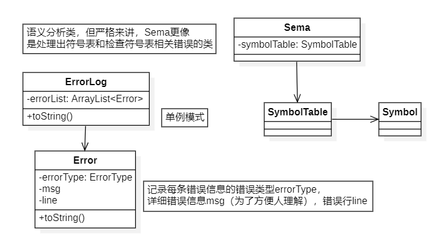

# 语义分析
## 任务
1. 符号表
2. 对表达式和赋值语句中的操作数进行类型一致性检查
3. 分析语法分析识别出的语句的意义

## 架构

采用**语法制导翻译**，在**词法分析和语法分析阶段**进行错误处理，建立一个简易符号表以供查询符号表相关错误。建立一张单例模式的错误信息表`errorLog`。

接下来对错误进行分类：

### 词法分析阶段处理——非法符号a

新建`token`时，如果是 `WordType.STRCON` 类型：

```java
public void errorCheck() {
    if (type == WordType.STRCON) {
        String val = value.substring(1, value.length() - 1);
        String regrex = "[\\x00-\\x1F\\x22-\\x27\\x7F]";
        Pattern pattern = Pattern.compile(regrex);
        Matcher matcher = pattern.matcher(val);
        if (matcher.find()) {
            ErrorLog.addError(ErrorType.INVALID_CHAR_IN_FSTRING, line);
        }
        if (!val.matches(".*?\\[^n].*")) {
            ErrorLog.addError(ErrorType.INVALID_CHAR_IN_FSTRING, line);
        }
    }
}
```

### 符号表相关错误——b,c,d,e,h

| 错误类别码 | 错误类型                                 | 解决思路               |
| ---------- | ---------------------------------------- | ---------------------- |
| b          | 名字重定义（函数名和变量名重定义）       | 在当前作用域内查找     |
| c          | 可执行语句使用未定义的名字               | 不断往直接外层查找     |
| d          | 函数参数个数不匹配                       |                        |
| e          | 函数参数类型不匹配                       |                        |
| h          | 不能改变常量的值                         |                        |
| f          | 无返回值的函数存在不匹配的return语句     | 在`FuncDef` 内进行处理 |
| g          | 有返回值的函数缺少return语句（函数末尾） |                        |

在语法分析阶段，处理出符号表，每条符号表信息包括标识符名`ident`、是否为常量`isConst`、类型`type`。在这里错误处理和生成中间代码共用一张符号表，错误处理（即语法分析阶段）仅处理以上三个信息，为此，我们需要在`SymbolTable`中新增`ArrayList<SymbolTable> childTable` 和 `int curNum` 属性。为了更好的处理出`type`,  需要为exp写calculate。

### 缺少符号

| 错误类别码 | 错误类型     | 解决思路                                                     |
| ---------- | ------------ | ------------------------------------------------------------ |
| i          | 缺少分号     | 在不依靠分号进行判断的地方，直接判断下一个读入的是不是分号，如果是就放入语法树，否则产生错误信息并新建一个分号token放入语法树。但`stmt`中有依靠分号进行判断成分的地方，比如说`return [exp];`，我们可以尝试贪婪分析（详细分析见下方） |
| j          | 缺少右小括号 |                                                              |
| k          | 缺少又中括号 |                                                              |

#### 缺少分号

```
stmt -> 'return' [exp] ';'
stmt -> Lval '=' 'getint' '(' ')' ';' | Lval '=' Exp ';' | [Exp] ';'
```

先尝试匹配，如果匹配失败`throw Exception` 就回溯。

#### 架构修改

1. 为了能尽可能保留语法分析处理成果，将`AstNode`的每个成分所存储的内容进行分类。
2. `tokenManager.getNextToken()` 方法调用时要和所需要的类型进行匹配，否则报错。
3. 为了能完成回溯动作，`tokenManager`新增`backupBuffer` 属性，在尝试匹配的时候打开`isBackup`开关。
4. 为了正确显示报错行号，`tokenManager` 新增属性`prevToken`。

### 语法分析阶段处理的其他错误——f,g,l,m

| 错误类别码 | 错误类型                            | 解决思路                                                     |
| ---------- | ----------------------------------- | ------------------------------------------------------------ |
| l          | printf中格式字符与表达式个数不匹配  | 在`errorLog`类中写该方法，仅需判断`stmtPrintf.getExps().getSize` 是否等于`formatString`中 `%d` 的个数。 |
| m          | 在非循环块中使用break和continue语句 | `parser`新增属性`isInLoop`                                   |

